# 🧠 MCP Blender Bridge

> **Connect Google Gemini to Blender via the Model Context Protocol.**
> *Orchestrate complex 3D workflows with natural language, safely and efficiently.*


---

## 🚀 Introduction

**MCP Blender Bridge** is a professional-grade integration that allows Large Language Models (like Google Gemini) to control Blender.

Unlike simple "code injection" scripts, this project uses the **Model Context Protocol (MCP)** to establish a secure, structured, and state-aware communication channel. It transforms Blender into a set of intelligent tools that the AI can discover, learn, and execute.

## 📖 The Story: Why this Architecture?

We didn't just build a bridge; we built a dam against chaos.
Our journey took us from dangerous `exec()` calls to a robust **Controlled Injection** system.

👉 **[Read the full story of our technical evolution here](docs/evolution_du_projet.md)** (French)

## 🏗️ Architecture

The system relies on a **Bridge Protocol** to ensure stability (Blender doesn't like being touched from the outside) and security.

```mermaid
graph LR
    subgraph "AI Layer"
        Gemini[🤖 Google Gemini]
    end

    subgraph "MCP Server (Controller)"
        API[FastAPI Server]
        Inventory[📚 Dual Inventory]
        Validator[🛡️ Security Validator]
    end

    subgraph "Blender (Peripheral)"
        Addon[🔌 Blender Addon]
        BPY[🐍 BPY API]
    end

    Gemini <-->|"MCP Protocol (Tools)"| API
    API <--> Inventory
    API -->|"1. Generate Script"| Validator
    Validator -->|"2. Validated Command"| API
    Addon -->|"3. Long Polling"| API
    API -->|"4. Command"| Addon
    Addon -->|"5. Execution"| BPY
```



## ✨ Key Features

*   **🛡️ Secure by Design**: No arbitrary code execution. Every command is validated against a strict allowlist of tools.
*   **🧠 Dual Inventory System**:
    *   **Capabilities**: Atomic, low-level tools (e.g., `mesh.create_cube`).
    *   **Knowledge Base**: High-level "Recipes" for complex objects (e.g., `furniture.chair`).
*   **🔍 Dynamic Discovery (RAG)**: The AI searches for tools as needed, preventing context window overflow.
*   **🔌 Robust Bridge**: Uses HTTP Long Polling to communicate with Blender's main thread without freezing the UI.
*   **📝 Inspection & Learning**: The AI can inspect tools to understand their parameters before using them.

## 📚 Documentation

Explore our comprehensive documentation in the `docs/` folder:

| Document | Description |
| :--- | :--- |
| **[User Guide](docs/user_guide.md)** | 🎓 Installation, configuration, and first steps. |
| **[Architecture](docs/architecture.md)** | 🏗️ Deep dive into the system design and protocols. |
| **[Developer Guide](docs/developer_guide.md)** | 💻 How to contribute, add tools, and debug. |
| **[API Reference](docs/api_reference.md)** | ⚙️ Technical details of endpoints and schemas. |

## ⚡ Quick Start (Windows)

### Option A: The Easy Way (Installer)
1.  Go to `installer_build/` and run **`mcp_installer.exe`**.
2.  Follow the prompts to configure your API Key.
3.  Open Blender and look for the **Gemini MCP** tab in the sidebar (`N`).

### Option B: The Manual Way
1.  **Controller**:
    ```bash
    cd controller
    uvicorn app.main:app --reload
    ```
2.  **Blender**:
    *   Install the addon from `blender_addon/`.
    *   Set your API Key in Addon Preferences.
    *   Click **Connect** in the 3D Viewport sidebar.

## 🤝 Contributing

We welcome contributions! Whether it's adding new tools to the inventory or improving the core bridge.
Please read **[CONTRIBUTING.md](CONTRIBUTING.md)** and the **[Developer Guide](docs/developer_guide.md)** before jumping in.

---
*Built with ❤️ for the Blender & AI Community.*