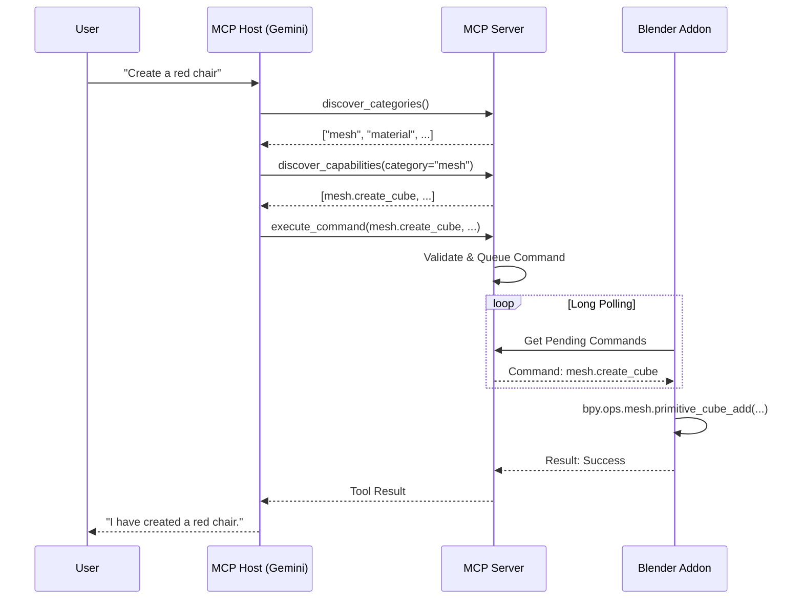

# MCP Blender Architecture

This document provides a high-level overview of the architecture for the MCP Blender integration.

## System Overview

The system is designed to bridge the gap between a Large Language Model (LLM) like Google Gemini and the complex, stateful environment of Blender. It follows the **Model Context Protocol (MCP)** to standardize this interaction.

### Components

The architecture consists of three main components:

1.  **MCP Host (The AI)**:
    *   **Role**: The intelligent agent (e.g., Gemini, Claude) that interprets user requests and decides which tools to call.
    *   **Function**: It discovers tools exposed by the MCP Server and executes them to achieve the user's goal.
    *   **Context**: It maintains the conversation history and the "context" of the current task.

2.  **MCP Server (The Controller)**:
    *   **Role**: A standalone Python server (FastAPI) that acts as the intermediary.
    *   **Function**:
        *   Exposes Blender's capabilities as MCP Tools.
        *   Manages the "Dual Inventory" of tools (Capabilities and Knowledge Base).
        *   Validates requests against a secure schema.
        *   Queues commands for the Blender Addon.
    *   **Location**: `controller/` directory.

3.  **Peripheral (The Blender Addon)**:
    *   **Role**: A plugin installed directly inside Blender.
    *   **Function**:
        *   Acts as a "dumb" executor.
        *   Polls the Controller for pending commands via a long-polling bridge.
        *   Executes commands using the internal `bpy` API.
        *   Sends feedback (success/failure, object data) back to the Controller.
    *   **Location**: `blender_addon/` directory.

## Interaction Flow

## Key Concepts

### Dual Inventory Architecture

To handle the vast number of potential operations in Blender without overwhelming the AI's context window, we use a "Dual Inventory" system:

1.  **Capabilities (Low-Level)**:
    *   Granular, atomic operations (e.g., `translate`, `rotate`, `create_cube`).
    *   Defined in `controller/capabilities/`.
    *   Dynamically loaded based on category.

2.  **Knowledge Base (High-Level)**:
    *   Composite "Recipes" that combine multiple low-level tools (e.g., `create_table`, `setup_lighting`).
    *   Defined in `controller/knowledge_base/`.
    *   Allows the AI to learn and reuse complex workflows.

### The Bridge Protocol

Communication between the Controller (external process) and Blender (embedded Python) is challenging because Blender's Python API (`bpy`) is not thread-safe and blocks the main loop.

*   **Solution**: HTTP Long Polling.
*   **Mechanism**: The Blender Addon sends a request to the Controller asking for work. The Controller holds this request open until a command is available or a timeout occurs.
*   **Benefits**:
    *   **Responsiveness**: Commands are executed almost immediately.
    *   **Stability**: No need for complex threading or socket management inside Blender.
    *   **Simplicity**: Uses standard HTTP protocols.

### Security

*   **No Arbitrary Code Execution**: The AI cannot simply send Python code to be executed. It must use pre-defined tools.
*   **Validation**: The Controller validates all parameters against strict schemas before passing them to Blender.
